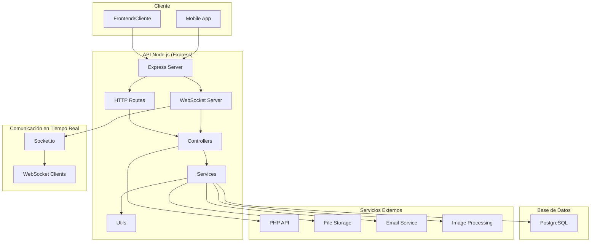
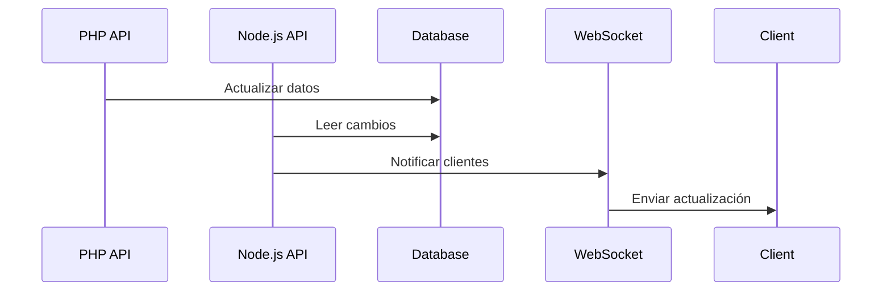

# Arquitectura - Node.js API

## Visión General de la Arquitectura

La API Node.js del sistema GFC-Back está diseñada siguiendo una arquitectura **modular y event-driven**, complementando la API PHP principal con capacidades de comunicación en tiempo real y procesamiento de archivos.

## Diagrama de Arquitectura



## Capas Arquitectónicas

### 1. Capa de Presentación (Routes)
- **Responsabilidad**: Definición de endpoints HTTP y WebSocket
- **Componentes**: Archivos de rutas en `routes/`
- **Patrón**: RESTful API + WebSocket events
- **Middleware**: Autenticación, validación, CORS

### 2. Capa de Control (Controllers)
- **Responsabilidad**: Manejo de requests y lógica de negocio
- **Componentes**: Controladores en `controllers/`
- **Patrón**: MVC Controller pattern
- **Validación**: Input validation y business rules

### 3. Capa de Servicios (Services)
- **Responsabilidad**: Lógica de negocio compleja y operaciones
- **Componentes**: Servicios especializados
- **Patrón**: Service layer pattern
- **Reutilización**: Lógica compartida entre controladores

### 4. Capa de Acceso a Datos (Database)
- **Responsabilidad**: Interacción con base de datos
- **Componentes**: Knex.js queries
- **Patrón**: Query builder pattern
- **Migraciones**: Gestión de esquema de base de datos

### 5. Capa de Utilidades (Utils)
- **Responsabilidad**: Funciones auxiliares y helpers
- **Componentes**: Utilidades reutilizables
- **Patrón**: Utility functions
- **Especialización**: Funciones específicas por dominio

## Estructura de Directorios Detallada

```
node_api/
├── controllers/                    # Controladores de la API
│   ├── log_operaciones.js         # Controlador de logs
│   └── mailer.js                  # Controlador de emails
├── migrations/                     # Migraciones de base de datos
│   ├── 250506_create_contest.js   # Migración de concursos
│   ├── 250506_create_profile.js   # Migración de perfiles
│   ├── 250506_create_role.js      # Migración de roles
│   ├── 250506_crete_user_table.js # Migración de usuarios
│   ├── 250506_log_operaciones.js  # Migración de logs
│   ├── 250508_create_category.js  # Migración de categorías
│   ├── 250508_create_contest_category.js # Migración de relación concurso-categoría
│   ├── 250508_create_contest_result.js # Migración de resultados
│   ├── 250508_create_contest_section.js # Migración de relación concurso-sección
│   ├── 250508_create_contests_records.js # Migración de registros de concursos
│   ├── 250508_create_fotoclub.js  # Migración de clubes fotográficos
│   ├── 250508_create_metric_abm.js # Migración de métricas
│   ├── 250508_create_section.js   # Migración de secciones
│   ├── 250519_create_section.js   # Migración adicional de secciones
│   └── 250622_recupera_pass.js    # Migración de recuperación de contraseña
├── routes/                         # Rutas de la API
│   ├── auth.js                    # Rutas de autenticación
│   ├── category.js                # Rutas de categorías
│   ├── contest.js                 # Rutas de concursos
│   ├── fotoclub.js                # Rutas de clubes fotográficos
│   ├── log.js                     # Rutas de logs
│   ├── metrics.js                 # Rutas de métricas
│   ├── section.js                 # Rutas de secciones
│   └── user.js                    # Rutas de usuarios
├── gfc_web_sockets.js             # Servidor WebSocket principal
├── knexfile.js                    # Configuración de Knex.js
├── package.json                   # Dependencias del proyecto
├── server.js                      # Punto de entrada principal
└── nodemon.json                   # Configuración de desarrollo
```

## Patrones de Diseño Implementados

### 1. Model-View-Controller (MVC)
- **Model**: Representado por queries de Knex.js
- **View**: JSON responses para API REST
- **Controller**: Controladores en `controllers/`

### 2. Service Layer Pattern
- **Implementación**: Servicios especializados
- **Beneficios**: Separación de lógica de negocio
- **Reutilización**: Lógica compartida entre controladores

### 3. Repository Pattern (Parcial)
- **Implementación**: A través de Knex.js queries
- **Abstracción**: Separación de lógica de acceso a datos

### 4. Event-Driven Architecture
- **Implementación**: WebSockets con Socket.io
- **Beneficios**: Comunicación en tiempo real
- **Escalabilidad**: Desacoplamiento de componentes

### 5. Middleware Pattern
- **Implementación**: Express middleware
- **Funcionalidades**: Autenticación, validación, logging
- **Flexibilidad**: Pipeline de procesamiento de requests

## Flujo de Datos

### 1. HTTP Request Flow
```
Cliente → Express Router → Middleware → Controller → Service → Database → Response
```

### 2. WebSocket Event Flow
```
Cliente → Socket.io → Event Handler → Controller → Service → Database → Broadcast
```

### 3. File Processing Flow
```
Upload → Multer → Sharp Processing → File Storage → Database Update → Notification
```

## Componentes Clave

### 1. Express Server (server.js)
- **Propósito**: Configuración principal del servidor
- **Funcionalidades**: 
  - Middleware configuration
  - Route registration
  - Error handling
  - CORS configuration

### 2. WebSocket Server (gfc_web_sockets.js)
- **Propósito**: Servidor de comunicación en tiempo real
- **Funcionalidades**:
  - Socket.io configuration
  - Event handling
  - Room management
  - Authentication

### 3. Database Configuration (knexfile.js)
- **Propósito**: Configuración de base de datos
- **Funcionalidades**:
  - Connection pooling
  - Migration configuration
  - Environment-specific settings

### 4. Controllers
- **log_operaciones.js**: Gestión de logs del sistema
- **mailer.js**: Envío de emails y notificaciones

## Arquitectura de WebSockets

### 1. Eventos del Sistema
```javascript
// Eventos de usuario
'user:join'           // Usuario se conecta
'user:leave'          // Usuario se desconecta
'user:typing'         // Usuario está escribiendo

// Eventos de concurso
'contest:join'        // Unirse a un concurso
'contest:leave'       // Salir de un concurso
'contest:update'      // Actualización de concurso

// Eventos de resultados
'result:new'          // Nueva fotografía enviada
'result:evaluated'    // Fotografía evaluada
'result:winner'       // Ganador anunciado

// Eventos de notificación
'notification:new'    // Nueva notificación
'notification:read'   // Notificación leída
```

### 2. Estructura de Mensajes
```javascript
// Mensaje de entrada
{
  event: 'contest:join',
  data: {
    contestId: 1,
    userId: 1,
    timestamp: '2024-01-15T10:30:00Z'
  }
}

// Mensaje de salida
{
  event: 'contest:update',
  data: {
    contestId: 1,
    participants: 150,
    photos: 450,
    lastUpdate: '2024-01-15T10:30:00Z'
  },
  timestamp: '2024-01-15T10:30:00Z'
}
```

### 3. Gestión de Salas (Rooms)
```javascript
// Estructura de salas
'contest:1'           // Sala para concurso específico
'user:1'              // Sala privada de usuario
'admin:notifications' // Sala de administradores
'global'              // Sala global
```

## Integración con PHP API

### 1. Mecanismos de Sincronización
- **Database Sharing**: Base de datos compartida
- **HTTP Communication**: Llamadas entre APIs
- **Event-driven**: Comunicación por eventos
- **File System**: Compartir archivos procesados

### 2. Flujo de Integración


### 3. Puntos de Integración
- **User Management**: Sincronización de usuarios
- **Contest Updates**: Actualizaciones de concursos
- **File Processing**: Procesamiento de imágenes
- **Logging**: Logs centralizados

## Seguridad Arquitectónica

### 1. Autenticación WebSocket
```javascript
// Autenticación de conexión
io.use((socket, next) => {
  const token = socket.handshake.auth.token;
  if (verifyToken(token)) {
    socket.userId = decodeToken(token).userId;
    next();
  } else {
    next(new Error('Authentication error'));
  }
});
```

### 2. Autorización por Eventos
```javascript
// Verificación de permisos por evento
socket.on('contest:join', async (data) => {
  if (await hasPermission(socket.userId, 'contest:join', data.contestId)) {
    // Procesar evento
  } else {
    socket.emit('error', { message: 'Permission denied' });
  }
});
```

### 3. Rate Limiting
```javascript
// Limitación de eventos por usuario
const rateLimiter = new Map();

socket.on('event', (data) => {
  const userId = socket.userId;
  const now = Date.now();
  
  if (rateLimiter.has(userId) && now - rateLimiter.get(userId) < 1000) {
    socket.emit('error', { message: 'Rate limit exceeded' });
    return;
  }
  
  rateLimiter.set(userId, now);
  // Procesar evento
});
```

## Escalabilidad y Performance

### 1. Horizontal Scaling
- **Load Balancing**: Distribución de carga entre instancias
- **Session Management**: Gestión de sesiones compartidas
- **Database Scaling**: Escalado de base de datos

### 2. Caching Strategy
```javascript
// Cache de consultas frecuentes
const cache = new Map();

async function getContestData(contestId) {
  const cacheKey = `contest:${contestId}`;
  
  if (cache.has(cacheKey)) {
    return cache.get(cacheKey);
  }
  
  const data = await db('contests').where({ id: contestId }).first();
  cache.set(cacheKey, data);
  
  return data;
}
```

### 3. Connection Pooling
```javascript
// Configuración de pool de conexiones
const knex = require('knex')({
  client: 'postgresql',
  connection: {
    host: process.env.DB_HOST,
    port: process.env.DB_PORT,
    user: process.env.DB_USER,
    password: process.env.DB_PASSWORD,
    database: process.env.DB_NAME,
  },
  pool: {
    min: 2,
    max: 10,
    acquireTimeoutMillis: 30000,
    createTimeoutMillis: 30000,
    destroyTimeoutMillis: 5000,
    idleTimeoutMillis: 30000,
    reapIntervalMillis: 1000,
    createRetryIntervalMillis: 100,
  }
});
```

## Monitoreo y Observabilidad

### 1. Logging Strategy
```javascript
// Configuración de Winston
const winston = require('winston');

const logger = winston.createLogger({
  level: 'info',
  format: winston.format.combine(
    winston.format.timestamp(),
    winston.format.json()
  ),
  transports: [
    new winston.transports.File({ filename: 'error.log', level: 'error' }),
    new winston.transports.File({ filename: 'combined.log' })
  ]
});
```

### 2. Métricas de WebSocket
```javascript
// Métricas de conexiones
const metrics = {
  totalConnections: 0,
  activeConnections: 0,
  eventsPerSecond: 0,
  errorsPerSecond: 0
};

io.on('connection', (socket) => {
  metrics.totalConnections++;
  metrics.activeConnections++;
  
  socket.on('disconnect', () => {
    metrics.activeConnections--;
  });
});
```

### 3. Health Checks
```javascript
// Endpoint de health check
app.get('/health', async (req, res) => {
  try {
    // Verificar conexión a base de datos
    await knex.raw('SELECT 1');
    
    // Verificar WebSocket server
    const wsStatus = io.engine.clientsCount > 0;
    
    res.json({
      status: 'healthy',
      database: 'connected',
      websocket: wsStatus,
      timestamp: new Date().toISOString()
    });
  } catch (error) {
    res.status(503).json({
      status: 'unhealthy',
      error: error.message
    });
  }
});
```

## Deployment y DevOps

### 1. Containerization
```dockerfile
# Dockerfile para Node.js API
FROM node:14-alpine

WORKDIR /app

COPY package*.json ./
RUN npm ci --only=production

COPY . .

EXPOSE 3000

CMD ["npm", "start"]
```

### 2. Environment Configuration
```javascript
// Configuración por entorno
const config = {
  development: {
    port: 3000,
    database: {
      host: 'localhost',
      port: 5432
    },
    websocket: {
      cors: {
        origin: "http://localhost:3000"
      }
    }
  },
  production: {
    port: process.env.PORT || 3000,
    database: {
      host: process.env.DB_HOST,
      port: process.env.DB_PORT
    },
    websocket: {
      cors: {
        origin: process.env.ALLOWED_ORIGINS?.split(',')
      }
    }
  }
};
```

### 3. PM2 Configuration
```javascript
// ecosystem.config.js
module.exports = {
  apps: [{
    name: 'gfc-node-api',
    script: 'server.js',
    instances: 'max',
    exec_mode: 'cluster',
    env: {
      NODE_ENV: 'development'
    },
    env_production: {
      NODE_ENV: 'production'
    }
  }]
};
```

## Consideraciones de Mantenimiento

### 1. Code Organization
- **Modular Structure**: Estructura modular por funcionalidad
- **Separation of Concerns**: Separación clara de responsabilidades
- **Clean Code Principles**: Principios de código limpio

### 2. Testing Strategy
- **Unit Testing**: Testing de funciones individuales
- **Integration Testing**: Testing de integración con base de datos
- **WebSocket Testing**: Testing de comunicación en tiempo real
- **Load Testing**: Testing de carga para WebSockets

### 3. Documentation
- **API Documentation**: Documentación de endpoints
- **WebSocket Events**: Documentación de eventos
- **Code Comments**: Comentarios de código
- **Architecture Documentation**: Documentación de arquitectura

---

**Navegación**: [README](README.md) | [Definición Técnica](definicion_tecnica.md) | [Endpoints](endpoints.md) | [Volver al README Principal](../../README.md) 