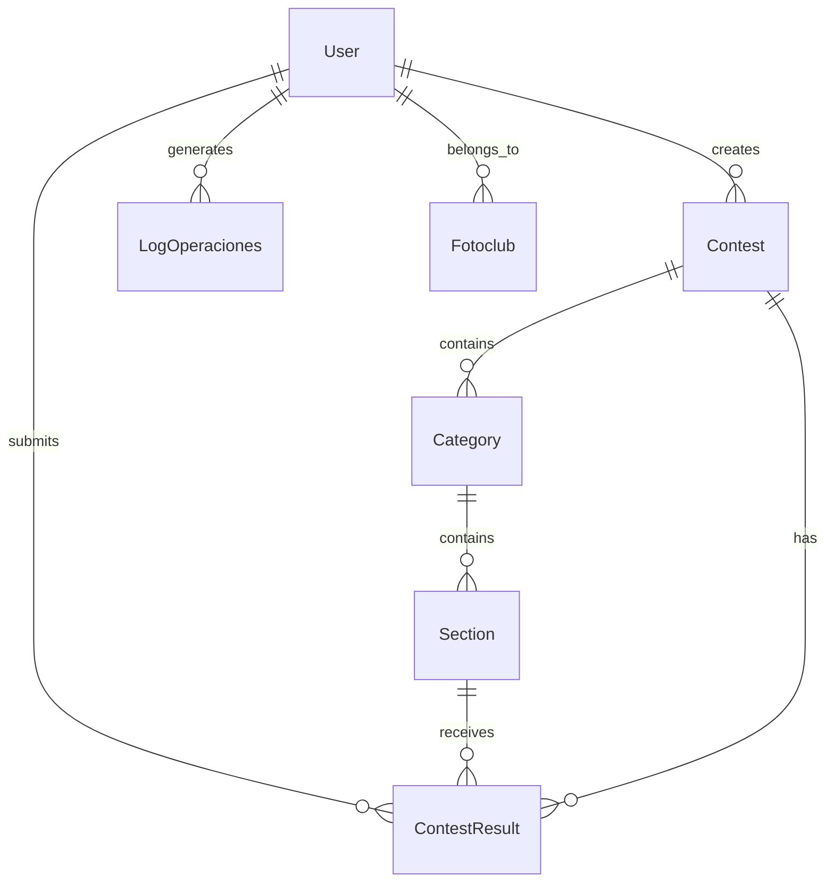

# Definición Técnica - Node.js API

## Especificación Técnica Exhaustiva

Este documento proporciona una especificación técnica completa y abstracta del sistema de comunicación en tiempo real y procesamiento de archivos implementado en Node.js/Express, permitiendo su reconstrucción en cualquier tecnología.

## 1. Modelo de Dominio

### 1.1 Entidades Principales

#### Usuario (User)
```typescript
interface User {
  id: number;
  username: string;
  email: string;
  password_hash: string;
  role_id: number;
  status: 'active' | 'inactive' | 'pending';
  created_at: timestamp;
  updated_at: timestamp;
  last_login: timestamp;
  email_verified: boolean;
  verification_token: string;
  reset_token: string;
  reset_expires: timestamp;
}
```

#### Concurso (Contest)
```typescript
interface Contest {
  id: number;
  title: string;
  subtitle: string;
  description: text;
  start_date: date;
  end_date: date;
  registration_deadline: date;
  max_photos_per_user: number;
  max_photos_per_section: number;
  status: 'draft' | 'active' | 'closed' | 'archived';
  created_by: number; // User ID
  created_at: timestamp;
  updated_at: timestamp;
  is_public: boolean;
  rules: text;
  prizes: text;
}
```

#### Categoría (Category)
```typescript
interface Category {
  id: number;
  name: string;
  description: text;
  contest_id: number;
  max_photos: number;
  created_at: timestamp;
  updated_at: timestamp;
}
```

#### Sección (Section)
```typescript
interface Section {
  id: number;
  name: string;
  description: text;
  category_id: number;
  max_photos: number;
  created_at: timestamp;
  updated_at: timestamp;
}
```

#### Resultado de Concurso (ContestResult)
```typescript
interface ContestResult {
  id: number;
  contest_id: number;
  user_id: number;
  section_id: number;
  photo_title: string;
  photo_description: text;
  file_path: string;
  thumbnail_path: string;
  score: number;
  position: number;
  status: 'submitted' | 'approved' | 'rejected' | 'winner';
  submitted_at: timestamp;
  evaluated_at: timestamp;
  evaluated_by: number; // User ID
  comments: text;
}
```

#### Log de Operaciones (LogOperaciones)
```typescript
interface LogOperaciones {
  id: number;
  user_id: number;
  operation_type: string;
  operation_description: text;
  ip_address: string;
  user_agent: string;
  request_data: json;
  response_data: json;
  status: 'success' | 'error' | 'warning';
  execution_time: number; // milliseconds
  created_at: timestamp;
}
```

#### Club Fotográfico (Fotoclub)
```typescript
interface Fotoclub {
  id: number;
  name: string;
  description: text;
  website: string;
  email: string;
  phone: string;
  address: text;
  city: string;
  country: string;
  logo_path: string;
  status: 'active' | 'inactive';
  created_at: timestamp;
  updated_at: timestamp;
}
```

### 1.2 Relaciones entre Entidades



## 2. Reglas de Negocio

### 2.1 Comunicación en Tiempo Real
- Los usuarios pueden conectarse a múltiples salas simultáneamente
- Las notificaciones se envían en tiempo real a usuarios específicos
- Los eventos de concurso se transmiten a todos los participantes
- La autenticación es requerida para conexiones WebSocket

### 2.2 Procesamiento de Archivos
- Las imágenes se procesan automáticamente al subirse
- Se generan miniaturas de diferentes tamaños
- Se valida el formato y tamaño de archivos
- Se optimizan las imágenes para web

### 2.3 Logging y Auditoría
- Todas las operaciones se registran automáticamente
- Los logs incluyen contexto completo de la operación
- Se mantiene historial de cambios por usuario
- Los logs se retienen por un período configurable

### 2.4 Sincronización con PHP API
- Los datos se sincronizan bidireccionalmente
- Los cambios se propagan en tiempo real
- Se mantiene consistencia de datos entre APIs
- Los conflictos se resuelven mediante timestamps

## 3. Arquitectura de Datos

### 3.1 Esquema de Base de Datos

#### Tabla: users
```sql
CREATE TABLE users (
    id SERIAL PRIMARY KEY,
    username VARCHAR(255) UNIQUE NOT NULL,
    email VARCHAR(255) UNIQUE NOT NULL,
    password_hash VARCHAR(255) NOT NULL,
    role_id INTEGER REFERENCES roles(id),
    status VARCHAR(20) DEFAULT 'pending',
    created_at TIMESTAMP DEFAULT CURRENT_TIMESTAMP,
    updated_at TIMESTAMP DEFAULT CURRENT_TIMESTAMP,
    last_login TIMESTAMP,
    email_verified BOOLEAN DEFAULT FALSE,
    verification_token VARCHAR(255),
    reset_token VARCHAR(255),
    reset_expires TIMESTAMP
);
```

#### Tabla: contests
```sql
CREATE TABLE contests (
    id SERIAL PRIMARY KEY,
    title VARCHAR(255) NOT NULL,
    subtitle VARCHAR(255),
    description TEXT,
    start_date DATE NOT NULL,
    end_date DATE NOT NULL,
    registration_deadline DATE NOT NULL,
    max_photos_per_user INTEGER DEFAULT 10,
    max_photos_per_section INTEGER DEFAULT 3,
    status VARCHAR(20) DEFAULT 'draft',
    created_by INTEGER REFERENCES users(id),
    created_at TIMESTAMP DEFAULT CURRENT_TIMESTAMP,
    updated_at TIMESTAMP DEFAULT CURRENT_TIMESTAMP,
    is_public BOOLEAN DEFAULT TRUE,
    rules TEXT,
    prizes TEXT
);
```

#### Tabla: log_operaciones
```sql
CREATE TABLE log_operaciones (
    id SERIAL PRIMARY KEY,
    user_id INTEGER REFERENCES users(id),
    operation_type VARCHAR(100) NOT NULL,
    operation_description TEXT,
    ip_address INET,
    user_agent TEXT,
    request_data JSONB,
    response_data JSONB,
    status VARCHAR(20) DEFAULT 'success',
    execution_time INTEGER, -- milliseconds
    created_at TIMESTAMP DEFAULT CURRENT_TIMESTAMP
);
```

### 3.2 Índices Optimizados
```sql
-- Índices para performance
CREATE INDEX idx_users_email ON users(email);
CREATE INDEX idx_users_username ON users(username);
CREATE INDEX idx_contests_status ON contests(status);
CREATE INDEX idx_contests_dates ON contests(start_date, end_date);
CREATE INDEX idx_log_operaciones_user ON log_operaciones(user_id);
CREATE INDEX idx_log_operaciones_type ON log_operaciones(operation_type);
CREATE INDEX idx_log_operaciones_created ON log_operaciones(created_at);
```

## 4. API REST Specification

### 4.1 Autenticación
- **Método**: JWT Bearer Token
- **Header**: `Authorization: Bearer <token>`
- **Refresh**: Endpoint para renovar tokens
- **Expiración**: Configurable (default: 24 horas)

### 4.2 Endpoints Base

#### Autenticación
```
POST /auth/login
POST /auth/register
POST /auth/logout
POST /auth/refresh
POST /auth/forgot-password
POST /auth/reset-password
POST /auth/verify-email
```

#### Usuarios
```
GET /users
GET /users/{id}
POST /users
PUT /users/{id}
DELETE /users/{id}
GET /users/{id}/profile
PUT /users/{id}/profile
```

#### Concursos
```
GET /contests
GET /contests/{id}
POST /contests
PUT /contests/{id}
DELETE /contests/{id}
GET /contests/{id}/categories
GET /contests/{id}/results
GET /contests/{id}/statistics
```

#### Logs
```
GET /logs
GET /logs/{id}
GET /logs/user/{user_id}
GET /logs/type/{operation_type}
POST /logs
```

#### Métricas
```
GET /metrics/overview
GET /metrics/contests
GET /metrics/users
GET /metrics/websocket
```

### 4.3 Formatos de Respuesta

#### Respuesta Exitosa
```json
{
  "success": true,
  "data": {
    // Datos de la respuesta
  },
  "message": "Operación exitosa",
  "timestamp": "2024-01-01T00:00:00Z"
}
```

#### Respuesta de Error
```json
{
  "success": false,
  "error": {
    "code": "VALIDATION_ERROR",
    "message": "Datos inválidos",
    "details": {
      "field": "Campo requerido"
    }
  },
  "timestamp": "2024-01-01T00:00:00Z"
}
```

## 5. WebSocket Specification

### 5.1 Eventos del Sistema

#### Eventos de Usuario
```typescript
interface UserEvents {
  'user:join': {
    userId: number;
    username: string;
    timestamp: string;
  };
  
  'user:leave': {
    userId: number;
    username: string;
    timestamp: string;
  };
  
  'user:typing': {
    userId: number;
    contestId: number;
    isTyping: boolean;
  };
}
```

#### Eventos de Concurso
```typescript
interface ContestEvents {
  'contest:join': {
    contestId: number;
    userId: number;
    timestamp: string;
  };
  
  'contest:leave': {
    contestId: number;
    userId: number;
    timestamp: string;
  };
  
  'contest:update': {
    contestId: number;
    participants: number;
    photos: number;
    lastUpdate: string;
  };
  
  'contest:status_change': {
    contestId: number;
    oldStatus: string;
    newStatus: string;
    timestamp: string;
  };
}
```

#### Eventos de Resultados
```typescript
interface ResultEvents {
  'result:new': {
    resultId: number;
    contestId: number;
    userId: number;
    photoTitle: string;
    timestamp: string;
  };
  
  'result:evaluated': {
    resultId: number;
    contestId: number;
    score: number;
    evaluatedBy: number;
    timestamp: string;
  };
  
  'result:winner': {
    resultId: number;
    contestId: number;
    userId: number;
    position: number;
    timestamp: string;
  };
}
```

#### Eventos de Notificación
```typescript
interface NotificationEvents {
  'notification:new': {
    id: number;
    userId: number;
    type: string;
    title: string;
    message: string;
    data: any;
    timestamp: string;
  };
  
  'notification:read': {
    id: number;
    userId: number;
    timestamp: string;
  };
}
```

### 5.2 Estructura de Mensajes

#### Mensaje de Entrada
```typescript
interface IncomingMessage {
  event: string;
  data: any;
  timestamp?: string;
  requestId?: string;
}
```

#### Mensaje de Salida
```typescript
interface OutgoingMessage {
  event: string;
  data: any;
  timestamp: string;
  requestId?: string;
  error?: {
    code: string;
    message: string;
  };
}
```

### 5.3 Gestión de Salas (Rooms)
```typescript
interface RoomManagement {
  // Salas de concurso
  'contest:{contestId}': ContestRoom;
  
  // Salas de usuario
  'user:{userId}': UserRoom;
  
  // Salas de administración
  'admin:notifications': AdminRoom;
  
  // Sala global
  'global': GlobalRoom;
}

interface ContestRoom {
  contestId: number;
  participants: number[];
  moderators: number[];
  isActive: boolean;
  lastActivity: string;
}
```

## 6. Algoritmos y Lógica de Negocio

### 6.1 Procesamiento de Imágenes
```typescript
interface ImageProcessor {
  // Configuración de procesamiento
  config: {
    maxWidth: number;
    maxHeight: number;
    quality: number;
    formats: string[];
    thumbnailSizes: number[];
  };
  
  // Procesar imagen principal
  processMainImage(file: Buffer): Promise<ProcessedImage>;
  
  // Generar miniaturas
  generateThumbnails(file: Buffer): Promise<Thumbnail[]>;
  
  // Optimizar para web
  optimizeForWeb(file: Buffer): Promise<Buffer>;
  
  // Validar archivo
  validateFile(file: File): ValidationResult;
}

interface ProcessedImage {
  originalPath: string;
  optimizedPath: string;
  thumbnails: Thumbnail[];
  metadata: ImageMetadata;
}

interface Thumbnail {
  size: number;
  path: string;
  width: number;
  height: number;
}
```

### 6.2 Sistema de Logging
```typescript
interface LoggingSystem {
  // Registrar operación
  logOperation(params: LogParams): Promise<void>;
  
  // Obtener logs por usuario
  getUserLogs(userId: number, filters: LogFilters): Promise<LogEntry[]>;
  
  // Obtener logs por tipo
  getLogsByType(operationType: string, filters: LogFilters): Promise<LogEntry[]>;
  
  // Limpiar logs antiguos
  cleanupOldLogs(retentionDays: number): Promise<number>;
  
  // Exportar logs
  exportLogs(filters: LogFilters, format: 'json' | 'csv'): Promise<Buffer>;
}

interface LogParams {
  userId: number;
  operationType: string;
  operationDescription: string;
  ipAddress: string;
  userAgent: string;
  requestData?: any;
  responseData?: any;
  status: 'success' | 'error' | 'warning';
  executionTime: number;
}
```

### 6.3 Sincronización de Datos
```typescript
interface DataSynchronization {
  // Sincronizar cambios con PHP API
  syncWithPHP(changes: DataChange[]): Promise<SyncResult>;
  
  // Detectar conflictos
  detectConflicts(localData: any, remoteData: any): Conflict[];
  
  // Resolver conflictos
  resolveConflicts(conflicts: Conflict[]): Promise<Resolution[]>;
  
  // Verificar consistencia
  checkConsistency(): Promise<ConsistencyReport>;
}

interface DataChange {
  table: string;
  operation: 'insert' | 'update' | 'delete';
  recordId: number;
  data: any;
  timestamp: string;
  userId: number;
}
```

## 7. Configuración del Sistema

### 7.1 Variables de Entorno
```env
# Base de datos
DB_HOST=localhost
DB_PORT=5432
DB_NAME=gfc_database
DB_USER=gfc_user
DB_PASSWORD=secure_password

# JWT
JWT_SECRET=your_jwt_secret_key
JWT_EXPIRATION=86400
JWT_REFRESH_EXPIRATION=604800

# WebSocket
WS_PORT=3001
WS_CORS_ORIGIN=http://localhost:3000
WS_MAX_CONNECTIONS=1000

# Procesamiento de imágenes
IMAGE_MAX_SIZE=10485760
IMAGE_ALLOWED_TYPES=jpg,jpeg,png,tiff
IMAGE_THUMBNAIL_SIZES=150,300,600
IMAGE_QUALITY=85

# Logging
LOG_LEVEL=info
LOG_RETENTION_DAYS=90
LOG_MAX_SIZE=10485760

# Email
SMTP_HOST=smtp.gmail.com
SMTP_PORT=587
SMTP_USER=your_email@gmail.com
SMTP_PASSWORD=your_app_password

# Aplicación
NODE_ENV=production
PORT=3000
API_URL=https://api.gfc-back.com
PHP_API_URL=https://php-api.gfc-back.com
```

### 7.2 Configuración de WebSocket
```javascript
// Configuración de Socket.io
const io = require('socket.io')(server, {
  cors: {
    origin: process.env.WS_CORS_ORIGIN,
    methods: ["GET", "POST"]
  },
  maxHttpBufferSize: 1e8, // 100MB
  pingTimeout: 60000,
  pingInterval: 25000,
  transports: ['websocket', 'polling']
});
```

## 8. Seguridad y Validación

### 8.1 Autenticación WebSocket
```typescript
interface WebSocketAuth {
  // Verificar token de conexión
  verifyConnectionToken(token: string): Promise<UserContext>;
  
  // Autenticar usuario en sala
  authenticateUserInRoom(userId: number, roomId: string): Promise<boolean>;
  
  // Verificar permisos por evento
  hasEventPermission(userId: number, event: string, data: any): Promise<boolean>;
  
  // Limitar conexiones por usuario
  limitUserConnections(userId: number, maxConnections: number): Promise<boolean>;
}
```

### 8.2 Validación de Entrada
```typescript
interface InputValidation {
  // Validar esquemas con Joi
  validateSchema(data: any, schema: Joi.Schema): ValidationResult;
  
  // Sanitizar entrada
  sanitizeInput(input: string): string;
  
  // Validar archivos
  validateFile(file: File): FileValidationResult;
  
  // Validar URLs
  validateUrl(url: string): boolean;
}

interface ValidationResult {
  isValid: boolean;
  errors: ValidationError[];
  sanitizedData?: any;
}
```

### 8.3 Rate Limiting
```typescript
interface RateLimiter {
  // Limitar requests HTTP
  limitHttpRequests(identifier: string, limit: number, window: number): Promise<boolean>;
  
  // Limitar eventos WebSocket
  limitWebSocketEvents(userId: number, event: string, limit: number, window: number): Promise<boolean>;
  
  // Limitar conexiones
  limitConnections(identifier: string, maxConnections: number): Promise<boolean>;
  
  // Obtener estadísticas de rate limiting
  getRateLimitStats(identifier: string): RateLimitStats;
}
```

## 9. Monitoreo y Observabilidad

### 9.1 Métricas de Performance
```typescript
interface PerformanceMetrics {
  // Métricas de HTTP
  http: {
    requestsPerSecond: number;
    averageResponseTime: number;
    errorRate: number;
    activeConnections: number;
  };
  
  // Métricas de WebSocket
  websocket: {
    totalConnections: number;
    activeConnections: number;
    eventsPerSecond: number;
    averageLatency: number;
  };
  
  // Métricas de base de datos
  database: {
    queriesPerSecond: number;
    averageQueryTime: number;
    connectionPoolUsage: number;
    slowQueries: number;
  };
  
  // Métricas de sistema
  system: {
    memoryUsage: number;
    cpuUsage: number;
    diskUsage: number;
    uptime: number;
  };
}
```

### 9.2 Health Checks
```typescript
interface HealthCheck {
  // Verificar estado general
  checkOverallHealth(): Promise<HealthStatus>;
  
  // Verificar base de datos
  checkDatabaseHealth(): Promise<HealthStatus>;
  
  // Verificar WebSocket server
  checkWebSocketHealth(): Promise<HealthStatus>;
  
  // Verificar servicios externos
  checkExternalServices(): Promise<HealthStatus[]>;
}

interface HealthStatus {
  service: string;
  status: 'healthy' | 'unhealthy' | 'degraded';
  responseTime: number;
  lastCheck: string;
  details?: any;
}
```

## 10. Testing Strategy

### 10.1 Tipos de Tests
```typescript
interface TestingStrategy {
  // Unit Tests
  unit: {
    coverage: 80;
    frameworks: ['Jest', 'Mocha'];
    focus: ['controllers', 'services', 'utils'];
  };
  
  // Integration Tests
  integration: {
    coverage: 70;
    frameworks: ['Jest', 'Supertest'];
    focus: ['API endpoints', 'database operations'];
  };
  
  // WebSocket Tests
  websocket: {
    coverage: 75;
    frameworks: ['Socket.io-testing'];
    focus: ['event handling', 'room management'];
  };
  
  // Load Tests
  load: {
    frameworks: ['Artillery', 'k6'];
    scenarios: ['HTTP API', 'WebSocket connections'];
  };
}
```

### 10.2 Cobertura de Testing
```typescript
interface TestCoverage {
  // Cobertura mínima requerida
  minimumCoverage: {
    unit: 80;
    integration: 70;
    websocket: 75;
    overall: 75;
  };
  
  // Métricas de calidad
  qualityMetrics: {
    cyclomaticComplexity: number;
    maintainabilityIndex: number;
    technicalDebt: number;
  };
}
```

## 11. Deployment y DevOps

### 11.1 Containerization
```dockerfile
# Dockerfile para Node.js API
FROM node:14-alpine

# Instalar dependencias del sistema
RUN apk add --no-cache \
    python3 \
    make \
    g++ \
    cairo-dev \
    jpeg-dev \
    pango-dev \
    musl-dev

# Crear directorio de trabajo
WORKDIR /app

# Copiar archivos de dependencias
COPY package*.json ./

# Instalar dependencias
RUN npm ci --only=production

# Copiar código de la aplicación
COPY . .

# Crear usuario no-root
RUN addgroup -g 1001 -S nodejs
RUN adduser -S nodejs -u 1001

# Cambiar propietario de archivos
RUN chown -R nodejs:nodejs /app
USER nodejs

# Exponer puertos
EXPOSE 3000 3001

# Health check
HEALTHCHECK --interval=30s --timeout=3s --start-period=5s --retries=3 \
  CMD curl -f http://localhost:3000/health || exit 1

# Comando de inicio
CMD ["npm", "start"]
```

### 11.2 Docker Compose
```yaml
# docker-compose.yml
version: '3.8'

services:
  node-api:
    build: ./node_api
    ports:
      - "3000:3000"
      - "3001:3001"
    environment:
      - NODE_ENV=production
      - DB_HOST=postgres
      - DB_PORT=5432
      - DB_NAME=gfc_database
      - DB_USER=gfc_user
      - DB_PASSWORD=secure_password
    depends_on:
      - postgres
    volumes:
      - ./uploads:/app/uploads
      - ./logs:/app/logs
    restart: unless-stopped

  postgres:
    image: postgres:13
    environment:
      - POSTGRES_DB=gfc_database
      - POSTGRES_USER=gfc_user
      - POSTGRES_PASSWORD=secure_password
    volumes:
      - postgres_data:/var/lib/postgresql/data
    ports:
      - "5432:5432"
    restart: unless-stopped

volumes:
  postgres_data:
```

Esta especificación técnica proporciona una base completa para implementar el sistema de comunicación en tiempo real y procesamiento de archivos en cualquier tecnología, manteniendo la funcionalidad y arquitectura definidas.

---

**Navegación**: [README](README.md) | [Arquitectura](arquitectura.md) | [Endpoints](endpoints.md) | [Volver al README Principal](../../README.md) 