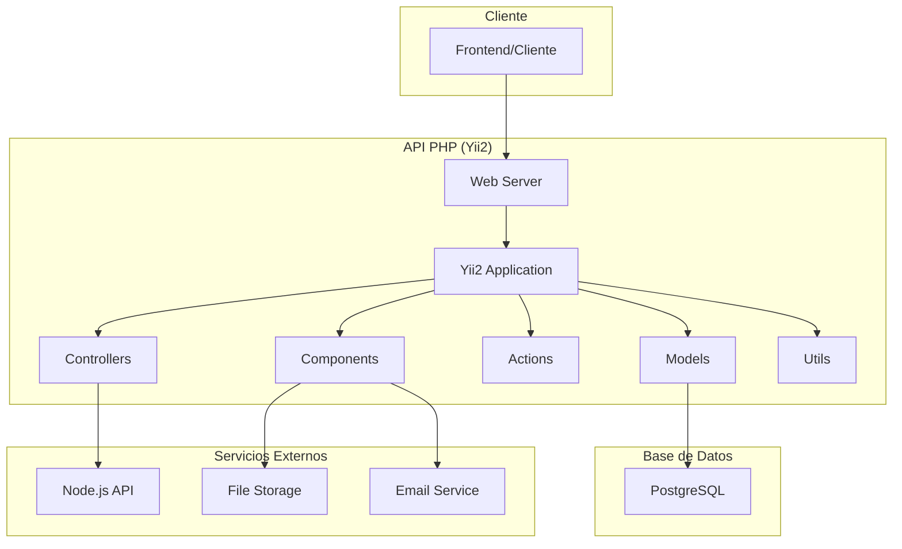

# Arquitectura - PHP API

## Visión General de la Arquitectura

La API PHP del sistema GFC-Back está diseñada siguiendo el patrón arquitectónico **Model-View-Controller (MVC)** implementado por el framework Yii2, con una estructura modular que permite escalabilidad y mantenibilidad.

## Diagrama de Arquitectura



## Capas Arquitectónicas

### 1. Capa de Presentación (Controllers)
- **Responsabilidad**: Manejo de requests HTTP y respuestas
- **Componentes**: Controladores REST API
- **Patrón**: RESTful API design
- **Autenticación**: JWT Token validation

### 2. Capa de Lógica de Negocio (Actions)
- **Responsabilidad**: Lógica específica de operaciones
- **Componentes**: Actions personalizadas
- **Patrón**: Command pattern
- **Validación**: Input validation y business rules

### 3. Capa de Acceso a Datos (Models)
- **Responsabilidad**: Interacción con base de datos
- **Componentes**: ActiveRecord models
- **Patrón**: Active Record pattern
- **Relaciones**: Definición de relaciones entre entidades

### 4. Capa de Servicios (Components)
- **Responsabilidad**: Servicios compartidos y utilidades
- **Componentes**: Custom components
- **Patrón**: Service layer pattern
- **Reutilización**: Lógica compartida entre controladores

## Estructura de Directorios Detallada

```
php_api/
├── actions/                    # Acciones específicas de la API
│   ├── Auth/                  # Acciones de autenticación
│   ├── Contest/               # Acciones de concursos
│   └── User/                  # Acciones de usuarios
├── commands/                  # Comandos de consola
│   ├── Controllers/           # Controladores de comandos
│   └── tmp/                   # Archivos temporales
├── components/                # Componentes personalizados
│   ├── HttpTokenAuth.php      # Autenticación JWT
│   └── ...                    # Otros componentes
├── config/                    # Configuraciones
│   ├── console.php            # Configuración de consola
│   ├── params.php             # Parámetros de aplicación
│   ├── test.php               # Configuración de testing
│   └── web.php                # Configuración web
├── controllers/               # Controladores de la API
│   ├── BaseController.php     # Controlador base
│   ├── AuthController.php     # Autenticación
│   ├── ContestController.php  # Concursos
│   └── ...                    # Otros controladores
├── migrations/                # Migraciones de BD
├── models/                    # Modelos de datos
│   ├── User.php               # Modelo de usuario
│   ├── Contest.php            # Modelo de concurso
│   └── ...                    # Otros modelos
├── traits/                    # Traits reutilizables
│   └── Filterable.php         # Filtrado de datos
├── utils/                     # Utilidades
│   └── LogManager.php         # Gestión de logs
├── views/                     # Vistas (si aplica)
└── web/                       # Punto de entrada
    └── index.php              # Entry point principal
```

## Patrones de Diseño Implementados

### 1. Model-View-Controller (MVC)
- **Model**: Representa los datos y la lógica de negocio
- **View**: Presentación de datos (en este caso JSON responses)
- **Controller**: Manejo de requests y coordinación

### 2. Active Record Pattern
- **Implementación**: Yii2 ActiveRecord
- **Beneficios**: Simplifica operaciones CRUD
- **Relaciones**: Definición automática de relaciones

### 3. Repository Pattern (Parcial)
- **Implementación**: A través de modelos
- **Abstracción**: Separación de lógica de acceso a datos

### 4. Service Layer Pattern
- **Implementación**: Components y Utils
- **Reutilización**: Lógica compartida entre controladores

### 5. Command Pattern
- **Implementación**: Actions específicas
- **Flexibilidad**: Operaciones complejas encapsuladas

## Flujo de Datos

### 1. Request Flow
```
Cliente → Web Server → Yii2 Router → Controller → Action → Model → Database
```

### 2. Response Flow
```
Database → Model → Action → Controller → JSON Response → Cliente
```

### 3. Authentication Flow
```
Request → JWT Validation → User Context → Authorization Check → Business Logic
```

## Componentes Clave

### 1. BaseController
- **Propósito**: Controlador base con funcionalidad común
- **Funcionalidades**: 
  - Autenticación JWT
  - Manejo de errores
  - Respuestas estandarizadas
  - Logging

### 2. HttpTokenAuth
- **Propósito**: Componente de autenticación JWT
- **Funcionalidades**:
  - Validación de tokens
  - Generación de tokens
  - Refresh tokens
  - User context

### 3. LogManager
- **Propósito**: Gestión centralizada de logs
- **Funcionalidades**:
  - Logging de operaciones
  - Diferentes niveles de log
  - Rotación de archivos

## Seguridad Arquitectónica

### 1. Autenticación
- **JWT Tokens**: Stateless authentication
- **Token Refresh**: Renovación automática
- **Expiration**: Tokens con tiempo de expiración

### 2. Autorización
- **Role-based Access Control (RBAC)**
- **Permission-based Access**
- **Resource-level Authorization**

### 3. Validación de Datos
- **Input Validation**: Validación de entrada
- **SQL Injection Protection**: Prepared statements
- **XSS Protection**: Escapado de datos
- **CSRF Protection**: Cross-site request forgery

### 4. Logging y Auditoría
- **Operation Logging**: Registro de operaciones
- **Error Logging**: Registro de errores
- **Security Events**: Eventos de seguridad

## Escalabilidad y Performance

### 1. Caching Strategy
- **Database Caching**: Cache de consultas
- **Application Caching**: Cache de aplicación
- **Static Asset Caching**: Cache de assets

### 2. Database Optimization
- **Indexing**: Índices optimizados
- **Query Optimization**: Consultas optimizadas
- **Connection Pooling**: Pool de conexiones

### 3. Load Balancing
- **Horizontal Scaling**: Escalado horizontal
- **Session Management**: Gestión de sesiones
- **Resource Distribution**: Distribución de recursos

## Integración con Otros Componentes

### 1. Node.js API Integration
- **HTTP Communication**: Comunicación HTTP
- **Data Synchronization**: Sincronización de datos
- **Event-driven Communication**: Comunicación por eventos

### 2. File Storage Integration
- **Image Processing**: Procesamiento de imágenes
- **File Upload**: Subida de archivos
- **Storage Management**: Gestión de almacenamiento

### 3. Email Service Integration
- **Notification System**: Sistema de notificaciones
- **Email Templates**: Plantillas de email
- **Delivery Tracking**: Seguimiento de entrega

## Monitoreo y Observabilidad

### 1. Logging
- **Application Logs**: Logs de aplicación
- **Error Logs**: Logs de errores
- **Performance Logs**: Logs de rendimiento

### 2. Metrics
- **Response Times**: Tiempos de respuesta
- **Throughput**: Rendimiento
- **Error Rates**: Tasas de error

### 3. Health Checks
- **Database Connectivity**: Conectividad de BD
- **Service Status**: Estado de servicios
- **Dependency Health**: Salud de dependencias

## Deployment y DevOps

### 1. Containerization
- **Docker Support**: Soporte para Docker
- **Environment Configuration**: Configuración de entornos
- **Service Discovery**: Descubrimiento de servicios

### 2. CI/CD Pipeline
- **Automated Testing**: Testing automatizado
- **Code Quality Checks**: Verificaciones de calidad
- **Automated Deployment**: Despliegue automatizado

### 3. Environment Management
- **Development**: Entorno de desarrollo
- **Staging**: Entorno de staging
- **Production**: Entorno de producción

## Consideraciones de Mantenimiento

### 1. Code Organization
- **Modular Structure**: Estructura modular
- **Separation of Concerns**: Separación de responsabilidades
- **Clean Code Principles**: Principios de código limpio

### 2. Documentation
- **API Documentation**: Documentación de API
- **Code Comments**: Comentarios de código
- **Architecture Documentation**: Documentación de arquitectura

### 3. Testing Strategy
- **Unit Testing**: Testing unitario
- **Integration Testing**: Testing de integración
- **End-to-End Testing**: Testing end-to-end

---

**Navegación**: [README](README.md) | [Definición Técnica](definicion_tecnica.md) | [Endpoints](endpoints.md) | [Volver al README Principal](../../README.md) 