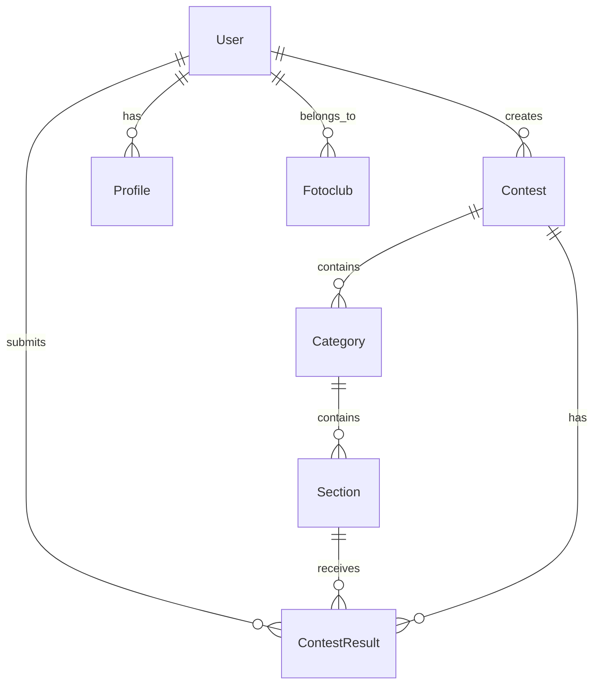

# Definición Técnica - PHP API

## Especificación Técnica Exhaustiva

Este documento proporciona una especificación técnica completa y abstracta del sistema de gestión de concursos fotográficos implementado en PHP/Yii2, permitiendo su reconstrucción en cualquier tecnología.

## 1. Modelo de Dominio

### 1.1 Entidades Principales

#### Usuario (User)
```typescript
interface User {
  id: number;
  username: string;
  email: string;
  password_hash: string;
  role_id: number;
  status: 'active' | 'inactive' | 'pending';
  created_at: timestamp;
  updated_at: timestamp;
  last_login: timestamp;
  email_verified: boolean;
  verification_token: string;
  reset_token: string;
  reset_expires: timestamp;
}
```

#### Concurso (Contest)
```typescript
interface Contest {
  id: number;
  title: string;
  subtitle: string;
  description: text;
  start_date: date;
  end_date: date;
  registration_deadline: date;
  max_photos_per_user: number;
  max_photos_per_section: number;
  status: 'draft' | 'active' | 'closed' | 'archived';
  created_by: number; // User ID
  created_at: timestamp;
  updated_at: timestamp;
  is_public: boolean;
  rules: text;
  prizes: text;
}
```

#### Categoría (Category)
```typescript
interface Category {
  id: number;
  name: string;
  description: text;
  contest_id: number;
  max_photos: number;
  created_at: timestamp;
  updated_at: timestamp;
}
```

#### Sección (Section)
```typescript
interface Section {
  id: number;
  name: string;
  description: text;
  category_id: number;
  max_photos: number;
  created_at: timestamp;
  updated_at: timestamp;
}
```

#### Resultado de Concurso (ContestResult)
```typescript
interface ContestResult {
  id: number;
  contest_id: number;
  user_id: number;
  section_id: number;
  photo_title: string;
  photo_description: text;
  file_path: string;
  thumbnail_path: string;
  score: number;
  position: number;
  status: 'submitted' | 'approved' | 'rejected' | 'winner';
  submitted_at: timestamp;
  evaluated_at: timestamp;
  evaluated_by: number; // User ID
  comments: text;
}
```

#### Perfil (Profile)
```typescript
interface Profile {
  id: number;
  user_id: number;
  first_name: string;
  last_name: string;
  bio: text;
  website: string;
  phone: string;
  address: text;
  city: string;
  country: string;
  profile_image: string;
  created_at: timestamp;
  updated_at: timestamp;
}
```

#### Club Fotográfico (Fotoclub)
```typescript
interface Fotoclub {
  id: number;
  name: string;
  description: text;
  website: string;
  email: string;
  phone: string;
  address: text;
  city: string;
  country: string;
  logo_path: string;
  status: 'active' | 'inactive';
  created_at: timestamp;
  updated_at: timestamp;
}
```

### 1.2 Relaciones entre Entidades



## 2. Reglas de Negocio

### 2.1 Gestión de Usuarios
- Los usuarios deben verificar su email antes de poder participar
- Las contraseñas deben cumplir requisitos mínimos de seguridad
- Los usuarios pueden tener diferentes roles (admin, judge, participant)
- Un usuario puede pertenecer a múltiples clubes fotográficos

### 2.2 Gestión de Concursos
- Un concurso debe tener al menos una categoría
- Las fechas de inicio y fin deben ser válidas
- El estado del concurso determina las operaciones permitidas
- Solo usuarios autorizados pueden crear concursos

### 2.3 Gestión de Participaciones
- Un usuario puede participar en múltiples concursos
- Límite de fotografías por usuario y por sección
- Las fotografías deben cumplir requisitos de formato y tamaño
- Sistema de puntuación con criterios definidos

### 2.4 Sistema de Evaluación
- Solo jueces autorizados pueden evaluar fotografías
- Sistema de puntuación de 0 a 10 con decimales
- Cálculo automático de posiciones por sección
- Generación de rankings y estadísticas

## 3. Arquitectura de Datos

### 3.1 Esquema de Base de Datos

#### Tabla: users
```sql
CREATE TABLE users (
    id SERIAL PRIMARY KEY,
    username VARCHAR(255) UNIQUE NOT NULL,
    email VARCHAR(255) UNIQUE NOT NULL,
    password_hash VARCHAR(255) NOT NULL,
    role_id INTEGER REFERENCES roles(id),
    status VARCHAR(20) DEFAULT 'pending',
    created_at TIMESTAMP DEFAULT CURRENT_TIMESTAMP,
    updated_at TIMESTAMP DEFAULT CURRENT_TIMESTAMP,
    last_login TIMESTAMP,
    email_verified BOOLEAN DEFAULT FALSE,
    verification_token VARCHAR(255),
    reset_token VARCHAR(255),
    reset_expires TIMESTAMP
);
```

#### Tabla: contests
```sql
CREATE TABLE contests (
    id SERIAL PRIMARY KEY,
    title VARCHAR(255) NOT NULL,
    subtitle VARCHAR(255),
    description TEXT,
    start_date DATE NOT NULL,
    end_date DATE NOT NULL,
    registration_deadline DATE NOT NULL,
    max_photos_per_user INTEGER DEFAULT 10,
    max_photos_per_section INTEGER DEFAULT 3,
    status VARCHAR(20) DEFAULT 'draft',
    created_by INTEGER REFERENCES users(id),
    created_at TIMESTAMP DEFAULT CURRENT_TIMESTAMP,
    updated_at TIMESTAMP DEFAULT CURRENT_TIMESTAMP,
    is_public BOOLEAN DEFAULT TRUE,
    rules TEXT,
    prizes TEXT
);
```

#### Tabla: categories
```sql
CREATE TABLE categories (
    id SERIAL PRIMARY KEY,
    name VARCHAR(255) NOT NULL,
    description TEXT,
    contest_id INTEGER REFERENCES contests(id) ON DELETE CASCADE,
    max_photos INTEGER DEFAULT 3,
    created_at TIMESTAMP DEFAULT CURRENT_TIMESTAMP,
    updated_at TIMESTAMP DEFAULT CURRENT_TIMESTAMP
);
```

#### Tabla: sections
```sql
CREATE TABLE sections (
    id SERIAL PRIMARY KEY,
    name VARCHAR(255) NOT NULL,
    description TEXT,
    category_id INTEGER REFERENCES categories(id) ON DELETE CASCADE,
    max_photos INTEGER DEFAULT 3,
    created_at TIMESTAMP DEFAULT CURRENT_TIMESTAMP,
    updated_at TIMESTAMP DEFAULT CURRENT_TIMESTAMP
);
```

#### Tabla: contest_results
```sql
CREATE TABLE contest_results (
    id SERIAL PRIMARY KEY,
    contest_id INTEGER REFERENCES contests(id) ON DELETE CASCADE,
    user_id INTEGER REFERENCES users(id) ON DELETE CASCADE,
    section_id INTEGER REFERENCES sections(id) ON DELETE CASCADE,
    photo_title VARCHAR(255) NOT NULL,
    photo_description TEXT,
    file_path VARCHAR(500) NOT NULL,
    thumbnail_path VARCHAR(500),
    score DECIMAL(3,2),
    position INTEGER,
    status VARCHAR(20) DEFAULT 'submitted',
    submitted_at TIMESTAMP DEFAULT CURRENT_TIMESTAMP,
    evaluated_at TIMESTAMP,
    evaluated_by INTEGER REFERENCES users(id),
    comments TEXT
);
```

### 3.2 Índices Optimizados
```sql
-- Índices para performance
CREATE INDEX idx_users_email ON users(email);
CREATE INDEX idx_users_username ON users(username);
CREATE INDEX idx_contests_status ON contests(status);
CREATE INDEX idx_contests_dates ON contests(start_date, end_date);
CREATE INDEX idx_contest_results_contest ON contest_results(contest_id);
CREATE INDEX idx_contest_results_user ON contest_results(user_id);
CREATE INDEX idx_contest_results_section ON contest_results(section_id);
CREATE INDEX idx_contest_results_score ON contest_results(score DESC);
```

## 4. API REST Specification

### 4.1 Autenticación
- **Método**: JWT Bearer Token
- **Header**: `Authorization: Bearer <token>`
- **Refresh**: Endpoint para renovar tokens
- **Expiración**: Configurable (default: 24 horas)

### 4.2 Endpoints Base

#### Autenticación
```
POST /auth/login
POST /auth/register
POST /auth/logout
POST /auth/refresh
POST /auth/forgot-password
POST /auth/reset-password
POST /auth/verify-email
```

#### Usuarios
```
GET /users
GET /users/{id}
POST /users
PUT /users/{id}
DELETE /users/{id}
GET /users/{id}/profile
PUT /users/{id}/profile
```

#### Concursos
```
GET /contests
GET /contests/{id}
POST /contests
PUT /contests/{id}
DELETE /contests/{id}
GET /contests/{id}/categories
GET /contests/{id}/results
GET /contests/{id}/statistics
```

#### Categorías
```
GET /categories
GET /categories/{id}
POST /categories
PUT /categories/{id}
DELETE /categories/{id}
GET /categories/{id}/sections
```

#### Secciones
```
GET /sections
GET /sections/{id}
POST /sections
PUT /sections/{id}
DELETE /sections/{id}
GET /sections/{id}/results
```

#### Resultados
```
GET /results
GET /results/{id}
POST /results
PUT /results/{id}
DELETE /results/{id}
POST /results/{id}/evaluate
GET /results/contest/{contest_id}
GET /results/user/{user_id}
```

### 4.3 Formatos de Respuesta

#### Respuesta Exitosa
```json
{
  "success": true,
  "data": {
    // Datos de la respuesta
  },
  "message": "Operación exitosa",
  "timestamp": "2024-01-01T00:00:00Z"
}
```

#### Respuesta de Error
```json
{
  "success": false,
  "error": {
    "code": "VALIDATION_ERROR",
    "message": "Datos inválidos",
    "details": {
      "field": "Campo requerido"
    }
  },
  "timestamp": "2024-01-01T00:00:00Z"
}
```

## 5. Algoritmos y Lógica de Negocio

### 5.1 Sistema de Puntuación
```typescript
interface ScoringAlgorithm {
  // Criterios de evaluación
  criteria: {
    composition: number;      // 0-10
    technical_quality: number; // 0-10
    creativity: number;       // 0-10
    relevance: number;        // 0-10
  };
  
  // Peso de cada criterio
  weights: {
    composition: 0.25;
    technical_quality: 0.30;
    creativity: 0.25;
    relevance: 0.20;
  };
  
  // Cálculo de puntuación final
  calculateFinalScore(criteria: Criteria): number {
    return (
      criteria.composition * this.weights.composition +
      criteria.technical_quality * this.weights.technical_quality +
      criteria.creativity * this.weights.creativity +
      criteria.relevance * this.weights.relevance
    );
  }
}
```

### 5.2 Cálculo de Rankings
```typescript
interface RankingAlgorithm {
  // Calcular posiciones por sección
  calculateSectionRankings(sectionId: number): Ranking[] {
    const results = this.getResultsBySection(sectionId);
    return results
      .sort((a, b) => b.score - a.score)
      .map((result, index) => ({
        ...result,
        position: index + 1
      }));
  }
  
  // Calcular ranking general
  calculateOverallRanking(contestId: number): Ranking[] {
    const results = this.getResultsByContest(contestId);
    return results
      .sort((a, b) => b.score - a.score)
      .map((result, index) => ({
        ...result,
        position: index + 1
      }));
  }
}
```

### 5.3 Validación de Archivos
```typescript
interface FileValidation {
  // Tipos de archivo permitidos
  allowedTypes: string[] = ['image/jpeg', 'image/png', 'image/tiff'];
  
  // Tamaño máximo (en bytes)
  maxSize: number = 10 * 1024 * 1024; // 10MB
  
  // Dimensiones mínimas
  minDimensions: { width: number; height: number } = { width: 800, height: 600 };
  
  // Validar archivo
  validateFile(file: File): ValidationResult {
    // Implementación de validación
  }
}
```

## 6. Configuración del Sistema

### 6.1 Variables de Entorno
```env
# Base de datos
DB_HOST=localhost
DB_PORT=5432
DB_NAME=gfc_database
DB_USER=gfc_user
DB_PASSWORD=secure_password

# JWT
JWT_SECRET=your_jwt_secret_key
JWT_EXPIRATION=86400
JWT_REFRESH_EXPIRATION=604800

# Email
SMTP_HOST=smtp.gmail.com
SMTP_PORT=587
SMTP_USER=your_email@gmail.com
SMTP_PASSWORD=your_app_password

# Archivos
UPLOAD_PATH=/var/www/uploads
MAX_FILE_SIZE=10485760
ALLOWED_EXTENSIONS=jpg,jpeg,png,tiff

# Aplicación
APP_ENV=production
APP_DEBUG=false
APP_URL=https://your-domain.com
```

### 6.2 Configuración de Cache
```php
// Configuración de cache
'cache' => [
    'class' => 'yii\caching\FileCache',
    'cachePath' => '@runtime/cache',
    'defaultDuration' => 3600,
],

// Cache de base de datos
'db' => [
    'class' => 'yii\db\Connection',
    'dsn' => 'pgsql:host=localhost;dbname=gfc_database',
    'username' => 'gfc_user',
    'password' => 'secure_password',
    'charset' => 'utf8',
    'enableSchemaCache' => true,
    'schemaCacheDuration' => 3600,
],
```

## 7. Seguridad y Validación

### 7.1 Validación de Entrada
```typescript
interface InputValidation {
  // Validación de email
  validateEmail(email: string): boolean {
    const emailRegex = /^[^\s@]+@[^\s@]+\.[^\s@]+$/;
    return emailRegex.test(email);
  }
  
  // Validación de contraseña
  validatePassword(password: string): ValidationResult {
    const minLength = 8;
    const hasUpperCase = /[A-Z]/.test(password);
    const hasLowerCase = /[a-z]/.test(password);
    const hasNumbers = /\d/.test(password);
    const hasSpecialChar = /[!@#$%^&*(),.?":{}|<>]/.test(password);
    
    return {
      isValid: password.length >= minLength && hasUpperCase && hasLowerCase && hasNumbers && hasSpecialChar,
      errors: []
    };
  }
  
  // Sanitización de entrada
  sanitizeInput(input: string): string {
    return input.trim().replace(/[<>]/g, '');
  }
}
```

### 7.2 Autenticación y Autorización
```typescript
interface AuthSystem {
  // Verificar token JWT
  verifyToken(token: string): UserContext | null;
  
  // Generar token
  generateToken(user: User): string;
  
  // Verificar permisos
  hasPermission(user: User, resource: string, action: string): boolean;
  
  // Verificar rol
  hasRole(user: User, role: string): boolean;
  
  // Validar header Authorization
  validateAuthorizationHeader(header: string | null): string | null;
  
  // Extraer token de forma segura
  extractToken(authHeader: string): string | null;
}
```

### 7.3 Manejo de Errores
```typescript
interface ErrorHandling {
  // Códigos de estado HTTP estándar
  httpStatusCodes: {
    OK: 200;
    CREATED: 201;
    BAD_REQUEST: 400;
    UNAUTHORIZED: 401;
    FORBIDDEN: 403;
    NOT_FOUND: 404;
    UNPROCESSABLE_ENTITY: 422;
    INTERNAL_SERVER_ERROR: 500;
  };
  
  // Estructura de respuesta de error
  errorResponse: {
    success: false;
    error: {
      code: string;
      message: string;
      details?: any;
    };
    timestamp: string;
  };
  
  // Manejo de errores de autenticación
  authenticationErrors: {
    MISSING_HEADER: 'Header Authorization requerido';
    INVALID_FORMAT: 'Formato de Authorization inválido';
    INVALID_TOKEN: 'Token inválido';
    EXPIRED_TOKEN: 'Token expirado';
  };
  
  // Validación de entrada segura
  safeInputValidation: {
    validateBodyReading(): string;
    validateHeaders(): boolean;
    sanitizeInput(input: string): string;
  };
}
```

## 8. Monitoreo y Logging

### 8.1 Estructura de Logs
```typescript
interface LogEntry {
  timestamp: string;
  level: 'DEBUG' | 'INFO' | 'WARNING' | 'ERROR' | 'CRITICAL';
  category: string;
  message: string;
  context: {
    user_id?: number;
    ip_address?: string;
    user_agent?: string;
    request_id?: string;
    [key: string]: any;
  };
}
```

### 8.2 Métricas de Performance
```typescript
interface PerformanceMetrics {
  // Tiempo de respuesta
  responseTime: number;
  
  // Throughput
  requestsPerSecond: number;
  
  // Uso de memoria
  memoryUsage: number;
  
  // Errores
  errorRate: number;
  
  // Base de datos
  databaseQueries: number;
  databaseResponseTime: number;
}
```

## 9. Testing Strategy

### 9.1 Tipos de Tests
- **Unit Tests**: Testing de métodos individuales
- **Integration Tests**: Testing de integración entre componentes
- **API Tests**: Testing de endpoints REST
- **Database Tests**: Testing de operaciones de base de datos
- **Security Tests**: Testing de vulnerabilidades

### 9.2 Cobertura de Testing
```typescript
interface TestCoverage {
  // Cobertura mínima requerida
  minimumCoverage: {
    unit: 80;
    integration: 70;
    api: 90;
  };
  
  // Métricas de calidad
  qualityMetrics: {
    cyclomaticComplexity: number;
    maintainabilityIndex: number;
    technicalDebt: number;
  };
}
```

## 10. Deployment y DevOps

### 10.1 Configuración de Servidor
```nginx
# Configuración Nginx
server {
    listen 80;
    server_name your-domain.com;
    root /var/www/html/web;
    index index.php;
    
    location / {
        try_files $uri $uri/ /index.php?$query_string;
    }
    
    location ~ \.php$ {
        fastcgi_pass unix:/var/run/php/php7.4-fpm.sock;
        fastcgi_index index.php;
        fastcgi_param SCRIPT_FILENAME $realpath_root$fastcgi_script_name;
        include fastcgi_params;
    }
}
```

### 10.2 Docker Configuration
```dockerfile
# Dockerfile
FROM php:7.4-fpm

# Instalar dependencias
RUN apt-get update && apt-get install -y \
    libpq-dev \
    libpng-dev \
    libjpeg-dev \
    libfreetype6-dev \
    && docker-php-ext-configure gd --with-freetype --with-jpeg \
    && docker-php-ext-install -j$(nproc) gd pdo pdo_pgsql

# Copiar código
COPY . /var/www/html
WORKDIR /var/www/html

# Instalar Composer
COPY --from=composer:latest /usr/bin/composer /usr/bin/composer

# Instalar dependencias
RUN composer install --no-dev --optimize-autoloader

# Configurar permisos
RUN chown -R www-data:www-data /var/www/html
```

Esta especificación técnica proporciona una base completa para implementar el sistema en cualquier tecnología, manteniendo la funcionalidad y arquitectura definidas.

---

**Navegación**: [README](README.md) | [Arquitectura](arquitectura.md) | [Endpoints](endpoints.md) | [Volver al README Principal](../../README.md) 